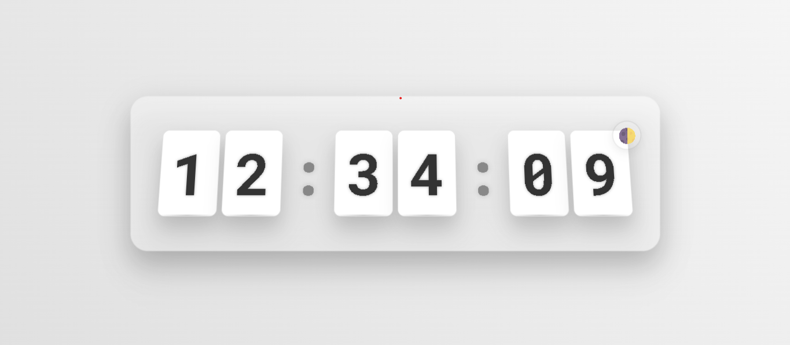

# Digital Flip Clock

A responsive digital flip clock with smooth CSS animations, 3D effects, and interactive features.



## Features

- Real-time clock updates with smooth flip animations
- 3D design with depth and perspective
- Dark/Light theme toggle with persistent settings
- Responsive design that works on all devices (mobile, tablet, desktop)
- Modern UI with gradient background and glass effect
- Fullscreen mode (double-click or press 'F' key)
- Special midnight animation effect
- Subtle flip sound effects (on user interaction)
- Dynamic document title that shows current time

## Live Demo

You can view a live demo of the clock here: [Digital Flip Clock Demo](/https://sk-ali-hussain.github.io/Flip-Clock/)

## Technologies Used

- HTML5
- CSS3 (animations, 3D transforms, CSS variables)
- JavaScript (ES6+)
- Google Fonts (Roboto Mono)
- LocalStorage for theme persistence

## How to Use

1. Clone this repository:
   ```
   git clone https://sk-ali-hussain/Flip-Clock.git
   ```
2. Open `index.html` in your browser
3. Enjoy the beautiful flip clock!

## Interactive Features

- **Double-click** the clock to toggle fullscreen mode
- Press the **F key** to toggle fullscreen mode
- Press the **T key** to toggle between dark and light themes
- Click the **moon/sun icon** to switch between dark and light themes
- The clock automatically adapts to your system's color scheme preference (if no saved preference)

## Customization

You can customize the clock by modifying the CSS variables in the `styles.css` file:
- Change colors in the gradient background
- Adjust the size of the clock digits
- Modify the animation timing
- Change the shadow and glow effects

## Browser Compatibility

This clock works in all modern browsers that support CSS animations, 3D transforms, and CSS variables:
- Chrome
- Firefox
- Safari
- Edge

## License

This project is licensed under the MIT License - see the [LICENSE](LICENSE) file for details.

## Acknowledgments

- Inspired by classic flip clocks
- Built with modern web technologies 
